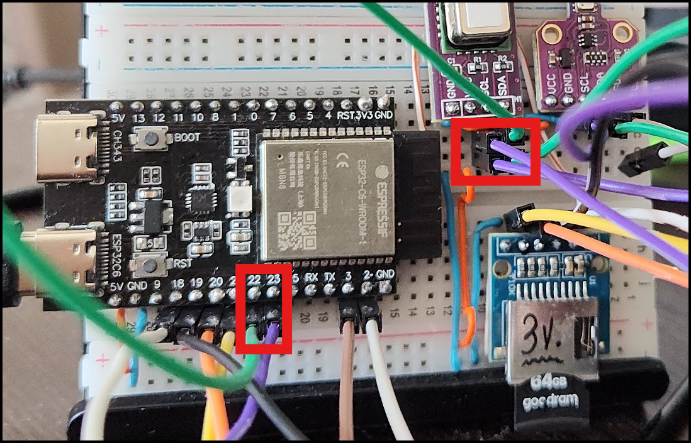

# Test I2C

This project is just a separate logical branch from another project. 

This is clean setup to test new `I2C` driver from `IDF 5.4.1` with few sensors I have.

I will reuse old examples to send\reveive commands, but with a new I2C driver.

NEW I2C driver from 5.4+ [version](https://docs.espressif.com/projects/esp-idf/en/v5.4.1/esp32c6/api-reference/peripherals/i2c.html)

## Info

This is a separate "branch" from my project [Air_Quality_station](https://github.com/trianglesis/Air_Quality_station/blob/4802c416501cf49720c3299119afd54bb335f894/README.md)

Where I stuck with `NACK` messages for any interaction with `I2C` device.

Compose driver using official documentation.

Test installed `I2C` device discovery with utility: [i2c_tools](https://github.com/espressif/esp-idf/blob/4c2820d377d1375e787bcef612f0c32c1427d183/examples/peripherals/i2c/i2c_tools/README.md)

Then, create a `I2C` bus and communicate with devices:

- `SCD40` - CO2 Sensor `0x62`
- `BME680` - temperature, humidity, pressure sensor `0x77`

## SDC4x

See datasheet.
Address: `0x62`

There are two representations for this sensor, both rely on old `I2C` driver and have partial implementation, something work, something is not:

- [ESP IDF Lib (old)](https://github.com/Sensirion/embedded-i2c-scd4x/blob/455a41c6b7a7a86a55d6647f5fc22d8574572b7b)
- [Sensirion (newer)](https://github.com/Sensirion/embedded-i2c-scd4x/blob/455a41c6b7a7a86a55d6647f5fc22d8574572b7b)
- [issue](https://github.com/UncleRus/esp-idf-lib/issues/582)
- [issue](https://github.com/UncleRus/esp-idf-lib/issues/624)
- [old driver](https://github.com/UncleRus/esp-idf-lib/issues/667)

My current issue with `ESO IDF Lib`

```log
I (10157) CO2 SCD41 INIT: run scd4x_get_serial_number
D (10167) i2cdev: Reconfiguring I2C driver on port 0
D (10167) intr_alloc: Connected src 50 to int 15 (cpu 0)
D (10177) i2cdev: I2C driver successfully reconfigured on port 0
D (10187) i2cdev: Timeout: ticks = 0 (0 usec) on port 0
D (10177) wifi:mms: 0->0
E (10187) i2cdev: Could not write to device [0x62 at 0]: -1 (ESP_FAIL)
ESP_ERROR_CHECK failed: esp_err_t 0xffffffff (ESP_FAIL) at 0x42011308
--- 0x42011308: sensor_init at D:/Projects/ESP/projects/ESP32-C6-OLED/Air_Quality_station/main/sensor_co2/co2_sensor.c:164 (discriminator 1)

file: "./main/sensor_co2/co2_sensor.c" line 164
func: sensor_init
expression: scd4x_get_serial_number(&dev, serial, serial + 1, serial + 2)

abort() was called at PC 0x4080b6d1 on core 0
--- 0x4080b6d1: _esp_error_check_failed at D:/Projects/ESP/Espressif/v5.4.1/esp-idf/components/esp_system/esp_err.c:49
```

## BME680

See datasheet.
Address: `0x77`

There is also a driver for `BME680` from the same repo, but again, it relies on an old `I2C` driver and there are issues with this driver:

- [ESP IDF Lib (old)](https://github.com/UncleRus/esp-idf-lib/blob/a02cd6bb5190cab379125140780adcb8d88f9650/components/bme680)
- [issue](https://github.com/UncleRus/esp-idf-lib/issues/609)
- [old driver](https://github.com/UncleRus/esp-idf-lib/issues/667)
- [Datasheet](https://www.bosch-sensortec.com/media/boschsensortec/downloads/datasheets/bst-bme680-ds001.pdf)

## Test and discover

Use `i2c_tools` from IDF official repo.

Both sensors are using same pins: `i2cconfig  --port=0 --freq=100000 --sda=22 --scl=23`



Both of them discovered correctly, this means pins and solder OK

```log
i2c-tools> i2cconfig  --port=0 --freq=100000 --sda=22 --scl=23
i2c-tools> i2cdetect
     0  1  2  3  4  5  6  7  8  9  a  b  c  d  e  f
00: 00 -- -- -- -- -- -- -- -- -- -- -- -- -- -- -- 
10: -- -- -- -- -- -- -- -- -- -- -- -- -- -- -- -- 
20: -- -- -- -- -- -- -- -- -- -- -- -- -- -- -- -- 
30: -- -- -- -- -- -- -- -- -- -- -- -- -- -- -- --
40: -- -- -- -- -- -- -- -- -- -- -- -- -- -- -- --
50: -- -- -- -- -- -- -- -- -- -- -- -- -- -- -- --
60: -- -- 62 -- -- -- -- -- -- -- -- -- -- -- -- --
70: -- -- -- -- -- -- -- 77 -- -- -- -- -- -- -- --
```


## Setup and run

Saving some doc here for faster accesss

### Init

```cpp
    i2c_master_bus_config_t i2c_mst_config = {
        .clk_source = I2C_CLK_SRC_DEFAULT,
        .i2c_port = I2C_PORT,
        .scl_io_num = COMMON_SCL_PIN,
        .sda_io_num = COMMON_SDA_PIN,
        .glitch_ignore_cnt = 7,
        .flags.enable_internal_pullup = true,
    };
```

- [i2c_master_bus_config_t](https://docs.espressif.com/projects/esp-idf/en/v5.4.1/esp32c6/api-reference/peripherals/i2c.html#_CPPv423i2c_master_bus_config_t)

Hints for LP:

- [LP core](https://docs.espressif.com/projects/esp-idf/en/v5.4.1/esp32c6/api-reference/peripherals/i2c.html#install-i2c-master-bus-with-lp-i2c-peripheral)

```cpp
i2c_master_bus_config_t i2c_mst_config = {
    .clk_source = LP_I2C_SCLK_DEFAULT,    // clock source for LP I2C, might different from HP I2C
    .i2c_port = LP_I2C_NUM_0,             // Assign to LP I2C port
    .scl_io_num = 7,                      // SCL IO number. Please refer to technical reference manual
    .sda_io_num = 6,                      // SDA IO number. Please refer to technical reference manual
    .glitch_ignore_cnt = 7,
    .flags.enable_internal_pullup = true,
};
```

Probably need to check PINs with names:
- `LP_GPIO6` - `LP_I2C_SDA`
- `LP_GPIO7` - `LP_I2C_SCL`


### Conf

# For SCD4x aka CO2 sensor

Config device or two

```cpp
    // Add CO2 sensor first
    i2c_device_config_t dev_cfg = {
        .dev_addr_length = I2C_ADDR_BIT_LEN_7,
        .device_address = SCD4X_I2C_ADDR,
        .scl_speed_hz = 100000,
    };
```

- [i2c_device_config_t](https://docs.espressif.com/projects/esp-idf/en/v5.4.1/esp32c6/api-reference/peripherals/i2c.html#_CPPv419i2c_device_config_t)
  - `disable_ack_check` - Disable ACK check. If this is set false, that means ack check is enabled, the transaction will be stopped and API returns error when nack is detected.
  - `scl_wait_us` - Timeout value. (unit: us). Please note this value should not be so small that it can handle stretch/disturbance properly. If 0 is set, that means use the default reg value


### Add

Add devices

```cpp
    // Add CO2 first
    i2c_master_dev_handle_t scd41_handle;
    ESP_ERROR_CHECK(i2c_master_bus_add_device(bus_handle, &scd41_cfg, &scd41_handle));
    // Add BME680 device second
    i2c_master_dev_handle_t bme680_handle;
    ESP_ERROR_CHECK(i2c_master_bus_add_device(bus_handle, &bme680_cfg, &bme680_handle));
```

- `bus_handle` -- [in] I2C bus handle.
  -  This is common bus for all devices!
- `dev_config` -- [in] device config.
  -  This is UNIQUE var for a SINGLE device
- `ret_handle` -- [out] device handle.
  -  This is UNIQUE handle of a SINGLE device

Returns:
- `ESP_OK`: Create I2C master device successfully.
- `ESP_ERR_INVALID_ARG`: I2C bus initialization failed because of invalid argument.
- `ESP_ERR_NO_MEM`: Create I2C bus failed because of out of memory.

Hint: use `i2c_master_get_bus_handle` to obtain al already created bus for another device to add, [doc](https://docs.espressif.com/projects/esp-idf/en/v5.4.1/esp32c6/api-reference/peripherals/i2c.html#get-i2c-master-handle-via-port)

```cpp
i2c_master_bus_handle_t bus_handle;
ESP_ERROR_CHECK(i2c_master_get_bus_handle(0, &bus_handle));
```

- `port_num` -- I2C port number for which the handle is to be retrieved.
- `ret_handle` -- Pointer to a variable where the retrieved handle will be stored.

Build and see if there are no errors in console.

### Test and use

Config the build now.
`LOG_DEFAULT_LEVEL` to debug
`I2C_ENABLE_DEBUG_LOG` to debug
`ESP_SYSTEM_PANIC_REBOOT_DELAY_SECONDS` to `120` seconds, to have a time to read the log.


Use [example](https://github.com/UncleRus/esp-idf-lib/blob/a02cd6bb5190cab379125140780adcb8d88f9650/examples/scd4x/default/main/main.c) (old) as refference.

We are skipping parts with `i2cdev` implemenatation and diretcly sending CMD to our sensor.

Will trink about consurrency later, when sensor starts to work.

### Wake UP

Start CO2 sensor with `wake_up` command using [I2C Master Write](https://docs.espressif.com/projects/esp-idf/en/v5.4.1/esp32c6/api-reference/peripherals/i2c.html#i2c-master-write)


| Command | Hex. Code  | I2C type     | time | During meas.  |
| :---    | :---       | :---         | :--- | :---          |
| `wake_up` | `0x36f6` | send command |  30  | no            |
| `get_serial_number` | `0x3682` | read | 1    | no            |


Using example from `Sensiniron`: [scd4x_wake_up](https://github.com/Sensirion/embedded-i2c-scd4x/blob/455a41c6b7a7a86a55d6647f5fc22d8574572b7b/scd4x_i2c.c#L585)

There is no other implemenatation of `HAL` or `i2c` driver, so we will use it now in RAW mode, directly communicating with device.

Assign vars and reuse buffer helpers from [Sensiniron](https://github.com/Sensirion/embedded-i2c-scd4x/blob/455a41c6b7a7a86a55d6647f5fc22d8574572b7b/sensirion_i2c.c#L180)

```cpp
    // Communicate with CO2
    uint8_t* buff_wr = communication_buffer;
    uint16_t local_offset = 0;
    local_offset = sensirion_i2c_add_command16_to_buffer(buff_wr, local_offset, 0x36f6);

    // Send wake_up cmd and wait 30 ms
    ESP_ERROR_CHECK(i2c_master_transmit(scd41_handle, buff_wr, local_offset, 30));
    ESP_LOGI(TAG, "CMD Wake Up sent!");
```

After sending the CMD - nothing bad happens, seems like it's working:

```log
I (1566) i2c_master: CMD Wake Up sent!
```

### Get Serial

Now send cmd and receive serial! Using:
- Sensiniron: [scd4x_get_serial_number](https://github.com/Sensirion/embedded-i2c-scd4x/blob/455a41c6b7a7a86a55d6647f5fc22d8574572b7b/scd4x_i2c.c#L448)
  - In Rasp example: [serial_number](https://github.com/Sensirion/embedded-i2c-scd4x/blob/455a41c6b7a7a86a55d6647f5fc22d8574572b7b/sample-implementations/RaspberryPi_Pico/main.c#L40)
- UncleRus: [scd4x_get_serial_number](https://github.com/UncleRus/esp-idf-lib/blob/a02cd6bb5190cab379125140780adcb8d88f9650/components/scd4x/scd4x.c#L317)

New `i2c` driver gives us fancy method to send and receive at once: [i2c_master_transmit_receive](https://docs.espressif.com/projects/esp-idf/en/v5.4.1/esp32c6/api-reference/peripherals/i2c.html#_CPPv427i2c_master_transmit_receive23i2c_master_dev_handle_tPK7uint8_t6size_tP7uint8_t6size_ti)

Use new method, [doc](https://docs.espressif.com/projects/esp-idf/en/v5.4.1/esp32c6/api-reference/peripherals/i2c.html#i2c-master-write-and-read)

Modify default method according to real method from `UncleRus` repo, with buffer len 3:

OR

Use Sensiniron approach and copy their method: [sensirion_common_copy_bytes](https://github.com/Sensirion/embedded-i2c-scd4x/blob/455a41c6b7a7a86a55d6647f5fc22d8574572b7b/scd4x_i2c.c#L463)

```cpp
    // Read serial number
    uint16_t serial_n_buff[3] = {0};
    local_offset = 0; // Reset offset
    local_offset = sensirion_i2c_add_command16_to_buffer(buff_wr, local_offset, 0x3682);
    // Send and receive after a short wait
    uint8_t buff_r[3] = {0};  // Output: serial number
    sleep_ms = 1 * 1000;
    ESP_ERROR_CHECK(i2c_master_transmit_receive(scd41_handle, buff_wr, sizeof(buff_wr), buff_r, sizeof(buff_r), sleep_ms));
    // Transform received:
    sensirion_common_copy_bytes(&buff_r[0], (uint8_t*)serial_n_buff, (sizeof(serial_n_buff) * 2));
    ESP_LOGI(TAG, "Sensor serial number is: 0x%x 0x%x 0x%x\n", (int)serial_n_buff[0], (int)serial_n_buff[1], (int)serial_n_buff[2]);
```

Where vars are:
- `serial_n_buff` - where to save parsed number, as per Sensiniron example
- `local_offset` - reset cmd buffer to 0 again
- `buffer` - where to receive the CMD `get serial num` output
- `sleep_ms` - from `UncleRus` example, wait for answer

The function args:
- `i2c_dev` -- [in] I2C master device handle that created by i2c_master_bus_add_device.
- `write_buffer` -- [in] Data bytes to send on the I2C bus.
- `write_size` -- [in] Size, in bytes, of the write buffer.
- `read_buffer` -- [out] Data bytes received from i2c bus.
- `read_size` -- [in] Size, in bytes, of the read buffer.
- `xfer_timeout_ms` -- [in] Wait timeout, in ms. Note: -1 means wait forever.

And it's working fine:

```log
I (1567) i2c_master: Sensor serial number is: 0x499f 0xe0 0x499f
```

By datasheet is should be like: `Example: serial number is 273’325’796’834’238`


| | | | |                                                                                       |
| :--- | :--- | :--- | :--- | :---                                                              |
| Write | 0x3682                                                                                |
| (hexadecimal) | Command                                                                       |
| Wait | 1 ms | command execution time                                                          |
| Response | 0xf896 | 0x31 | 0x9f07 | 0xc2 | 0x3bbe | 0x89                                      |
| (hexadecimal) | word[0] | CRC of 0xf896 |  word[1] | CRC of 0x9f07 | word[2] | CRC of 0x3bbe  |

Seems like I have a right response, but it should be converted, probably.

Testing different aaproaches and it now shows stable output:

```log
I (1567) i2c_master: Sensor serial number is: 0x499f 0xe0 0x1c24
```

Let's move forward and get more meaningfull data.

### Suddenly

It stopped working:

```log
I (591) i2c_master: Temperature sensor device added!
I (10601) i2c_master: All devices added! Start communication
E (10601) i2c.master: I2C transaction unexpected nack detected
E (10601) i2c.master: s_i2c_synchronous_transaction(924): I2C transaction failed
E (10601) i2c.master: i2c_master_multi_buffer_transmit(1186): I2C transaction failed
ESP_ERROR_CHECK failed: esp_err_t 0x103 (ESP_ERR_INVALID_STATE) at 0x4200c292
--- 0x4200c292: app_main at D:/Projects/ESP/projects/ESP32-C6/I2C-tests/main/main.c:99 (discriminator 1)

file: "./main/main.c" line 99
func: app_main
expression: i2c_master_transmit(scd41_handle, buff_wr, local_offset, 30)

```

Test I2C:

```log
i2c-tools> i2cdetect
     0  1  2  3  4  5  6  7  8  9  a  b  c  d  e  f
00: 00 -- -- -- -- -- -- -- -- -- -- -- -- -- -- --
10: -- -- -- -- -- -- -- -- -- -- -- -- -- -- -- -- 
20: -- -- -- -- -- -- -- -- -- -- -- -- -- -- -- --
30: -- -- -- -- -- -- -- -- -- -- -- -- -- -- -- --
40: -- -- -- -- -- -- -- -- -- -- -- -- -- -- -- --
50: -- -- -- -- -- -- -- -- -- -- -- -- -- -- -- --
60: -- -- 62 -- -- -- -- -- -- -- -- -- -- -- -- --
70: -- -- -- -- -- -- -- 77 -- -- -- -- -- -- -- -- 
```

It's ok...
Log is the same!

Now disable the wake up cmd and check again:

```log
I (10566) i2c_master: All devices added! Start communication
E (10566) i2c.master: I2C transaction unexpected nack detected
E (10566) i2c.master: s_i2c_synchronous_transaction(924): I2C transaction failed
E (10566) i2c.master: i2c_master_transmit_receive(1220): I2C transaction failed
ESP_ERROR_CHECK failed: esp_err_t 0x103 (ESP_ERR_INVALID_STATE) at 0x4200c2a0
--- 0x4200c2a0: app_main at D:/Projects/ESP/projects/ESP32-C6/I2C-tests/main/main.c:110 (discriminator 1)

file: "./main/main.c" line 110
func: app_main
expression: i2c_master_transmit_receive(scd41_handle, buff_wr, sizeof(buff_wr), buff_r, sizeof(buff_r), sleep_ms)

abort() was called at PC 0x40805835 on core 0
```

Adding while loop and retry counter:

```log
E (90767) i2c_master: Cannot get serial number of SO2 sensor! Retry: 2
E (95777) i2c.master: I2C transaction unexpected nack detected
E (95777) i2c.master: s_i2c_synchronous_transaction(924): I2C transaction failed
E (95777) i2c.master: i2c_master_transmit_receive(1220): I2C transaction failed
E (95777) i2c_master: Cannot get serial number of SO2 sensor! Retry: 1
I (100787) i2c_master: Sensor serial number is: 0xe0e0 0xe0 0x1bfc
E (100787) i2c.master: I2C transaction unexpected nack detected
E (100787) i2c.master: s_i2c_synchronous_transaction(924): I2C transaction failed
E (100787) i2c.master: i2c_master_multi_buffer_transmit(1186): I2C transaction failed
E (100797) i2c_master: Cannot start CO2 sensor measurements! Retry: 10
```

Will now change sensors, check wires and try while loop 100

As soon as sensor was plugged out and plugged in again:

```log
I (35656) i2c_master: CMD Wake Up sent!
I (35656) i2c_master: CMD Serial sent!
I (35656) i2c_master: Sensor serial number is: 0x4944 0x3e 0x1bfc
I (35656) i2c_master: CMD Start measurements sent! Get measumenets in 5 sec intervals
```

Another approach - trying to stop sensor at the startup:

```log
I (556) i2c_master: Master bus added!
I (556) i2c_master: CO2 sensor device added!
I (556) i2c_master: Temperature sensor device added!
I (566) i2c_master: All devices added! Start communication
I (566) i2c_master: CMD Stop Measurements sent at start! Wait 5 sec!
I (5576) i2c_master: CMD Wake Up sent!
I (5576) i2c_master: CMD Serial sent!
I (5576) i2c_master: Sensor serial number is: 0x4944 0x403e 0x0
I (5576) i2c_master: CMD Start measurements sent! Get measumenets in 5 sec intervals
I (5586) i2c_master: Data ready 58552 status: 1
I (5586) main_task: Returned from app_main()
```

And it works! Moving on...

### Start measurements


- [scd4x_start_periodic_measurement](https://github.com/Sensirion/embedded-i2c-scd4x/blob/455a41c6b7a7a86a55d6647f5fc22d8574572b7b/sample-implementations/RaspberryPi_Pico/main.c#L50)

```cpp
    // Start measurement
    sleep_ms = 1 * 5000; // Wait 5 seconds before trying to get measurements
    local_offset = 0; // Reset offset
    local_offset = sensirion_i2c_add_command16_to_buffer(buff_wr, local_offset, 0x21b1);
    ESP_ERROR_CHECK(i2c_master_transmit(scd41_handle, buff_wr, local_offset, sleep_ms));
    ESP_LOGI(TAG, "CMD Start measurements sent! Get measumenets in 5 sec intervals");
```


### Get Data Ready status

Moving forward and now we should get sensor readiness.

With all examples we have from above, we can repeat most of the code just to clarify the process.

The process is the same, use modern i2c driver call to obtain sensor readiness during CMD call.

```cpp
    // Consume measurements with 5 sec interval!
    TriesCount = 10;
    local_offset = 0; // Reset offset
    uint8_t buff_r[3] = {0};  // Output: serial number
    sleep_ms = (1 * 1000);  // Send cmd and wait 30 ms
    bool dataReady;
    uint16_t data_ready_status = 0;
    local_offset = sensirion_i2c_add_command16_to_buffer(buff_wr, local_offset, 0xe4b8);
    ret = i2c_master_transmit_receive(scd41_handle, buff_wr, sizeof(buff_wr), buff_r, sizeof(buff_r), sleep_ms);
    while (1) {
        if (ret != ESP_OK) {
            ESP_LOGE(TAG, "Cannot get Data ready status! Retry: %d", TriesCount);
            vTaskDelay(pdMS_TO_TICKS(5000));
            TriesCount--;
            if (TriesCount == 0)
                break;
        } else {
            data_ready_status = sensirion_common_bytes_to_uint16_t(&buff_wr[0]);
            dataReady = (data_ready_status & 2047) != 0;
            ESP_LOGI(TAG, "Data ready %d status: %d", data_ready_status, dataReady);
            break;
        }
    }
```


### Get Measurements

Use `i2c_master_transmit_receive`


```text
Description: reads the sensor output. The measurement data can only be read out once per signal update interval as the buffer 
is emptied upon read-out. If no data is available in the buffer, the sensor returns a NACK. To avoid a NACK response, the 
get_data_ready_status can be issued to check data status (see Section 3.9.2 for further details). The I2C master can abort the 
read transfer with a NACK followed by a STOP condition after any data byte if the user is not interested in subsequent data. 
```

| | | | |                                                                                                       |
| :--- | :--- | :--- | :--- | :---                                                                              |
| Write | 0xec05                                                                                                |
| (hexadecimal) | Command                                                                                       |
| Wait | 1 ms | command execution time                                                                          |
| Response | 0x01f4 | 0x33 | 0x6667 | 0xa2 | 0x5eb9 | 0x3c                                                      |
| (hexadecimal) | CO2 = 500 ppm | CRC of 0x01f4 |  Temp. = 25 °C | CRC of 0x6667 |  RH = 37% | CRC of 0x5eb9    |


Probably works:

```log
I (557) i2c_master: Master bus added!
I (557) i2c_master: CO2 sensor device added!
I (557) i2c_master: Temperature sensor device added!
I (567) i2c_master: All devices added! Start communication
I (567) i2c_master: CMD Stop Measurements sent at start! Wait 5 sec!
I (5577) i2c_master: CMD Wake Up sent!
I (5577) i2c_master: CMD Serial sent!
I (5577) i2c_master: Sensor serial number is: 0x4944 0x403e 0x0
I (5577) i2c_master: CMD Start measurements sent! Get measumenets in 5 sec intervals
I (10577) i2c_master: Data ready 58552 status: 1
I (11577) i2c_master: RAW Measurements ready co2: 779, t: 18028 C Humidity: 0 (raw value)
I (11577) main_task: Returned from app_main()
```

Added a dumb loop just for test and it works:

```log
I (557) i2c_master: Master bus added!
I (557) i2c_master: CO2 sensor device added!
I (557) i2c_master: Temperature sensor device added!
I (567) i2c_master: All devices added! Start communication
I (567) i2c_master: CMD Stop Measurements sent at start! Wait 5 sec!
I (5577) i2c_master: CMD Wake Up sent!
I (5577) i2c_master: CMD Serial sent!
I (5577) i2c_master: Sensor serial number is: 0x4944 0x3e 0x0
I (5577) i2c_master: CMD Start measurements sent! Get measumenets in 5 sec intervals
I (10577) i2c_master: Data ready 58552 status: 1
I (16577) i2c_master: RAW Measurements ready co2: 735, t: 29292 C Humidity: 0 (raw value)
I (21577) i2c_master: RAW Measurements ready co2: 726, t: 64107 C Humidity: 0 (raw value)
I (26577) i2c_master: RAW Measurements ready co2: 733, t: 4203 C Humidity: 0 (raw value)
I (31577) i2c_master: RAW Measurements ready co2: 806, t: 35947 C Humidity: 0 (raw value)
I (36577) i2c_master: RAW Measurements ready co2: 1024, t: 618 C Humidity: 0 (raw value)
I (41577) i2c_master: RAW Measurements ready co2: 1223, t: 53866 C Humidity: 0 (raw value)
I (46577) i2c_master: RAW Measurements ready co2: 1358, t: 54378 C Humidity: 0 (raw value)
I (51577) i2c_master: RAW Measurements ready co2: 1442, t: 26729 C Humidity: 0 (raw value)
I (56577) i2c_master: RAW Measurements ready co2: 1461, t: 48233 C Humidity: 0 (raw value)
I (56577) i2c_master: Stop measurements.
I (56577) main_task: Returned from app_main()
```


# For bme680 aka temp, humidity, pressure, AIQ sensor

Usign the same logic to add sensor to master bus:

```cpp
    // Configure BMD680
    i2c_device_config_t bme680_cfg = {
        .dev_addr_length = I2C_ADDR_BIT_LEN_7,
        .device_address = BME680_I2C_ADDR_1,
        .scl_speed_hz = I2C_FREQ_HZ,
    };
```

Now start digging the controls:

## Init and reset

There are two parts for sensor to init with: `register` and `command`:

```cpp
    uint8_t BME680_REG_RESET = 0xe0;
    uint8_t BME680_RESET_CMD = 0xb6;    // BME680_REG_RESET<7:0>
```

It seems pretty similar to what we can test with `i2c_tools`, I'll probe the registers to see how it works.

- `i2cget -c 0x77`
- `i2cset -c 0x77`
- `i2cdump -c 0x77`

```shell
i2c-tools> i2cconfig  --port=0 --freq=100000 --sda=22 --scl=23
i2c-tools> i2cdetect
     0  1  2  3  4  5  6  7  8  9  a  b  c  d  e  f
00: 00 -- -- -- -- -- -- -- -- -- -- -- -- -- -- -- 
10: -- -- -- -- -- -- -- -- -- -- -- -- -- -- -- -- 
20: -- -- -- -- -- -- -- -- -- -- -- -- -- -- -- -- 
30: -- -- -- -- -- -- -- -- -- -- -- -- -- -- -- --
40: -- -- -- -- -- -- -- -- -- -- -- -- -- -- -- --
50: -- -- -- -- -- -- -- -- -- -- -- -- -- -- -- --
60: -- -- 62 -- -- -- -- -- -- -- -- -- -- -- -- --
70: -- -- -- -- -- -- -- 77 -- -- -- -- -- -- -- --
i2c-tools> i2cget -c 0x77
0x80
i2c-tools> i2cset -c 0x77
I (169704) cmd_i2ctools: Write OK
i2c-tools> i2cdump -c 0x77
     0  1  2  3  4  5  6  7  8  9  a  b  c  d  e  f    0123456789abcdef
00: 29 aa 16 4b e3 00 32 10 00 00 01 00 0e 00 02 04    )??K?.2?..?.?.??
10: 10 00 40 00 80 00 1e 00 1f 7f 1f 10 00 00 00 80    ?.@.?.?.????...?
20: 00 00 80 00 00 80 00 80 00 00 00 04 00 04 00 00    ..?..?.?...?.?..
30: 80 00 00 80 00 00 80 00 80 00 00 00 04 00 04 00    ?..?..?.?...?.?.
40: 00 80 00 00 80 00 00 80 00 80 00 00 00 04 00 04    .?..?..?.?...?.?
50: 00 00 00 00 00 00 00 00 00 00 00 00 00 00 00 00    ................
60: 00 00 00 00 00 00 00 00 00 00 00 00 00 00 00 00    ................
70: 00 00 00 00 00 00 00 00 0f 04 fe 16 9b 08 00 ff    ........??????..
```

### Manually pull\push registers

Now test registers as per datasheet.
As I understand, I can `set` to register ADDR some cmd. Will see if I can set it manually.


Set: `i2cset --chip=0x77 --register=REG_ADDR DATA_CMD`

```shell
i2cset --chip=0x77 --register=0xe0 0xb6
```

And results:

```log
i2c-tools> i2cset --chip=0x77 --register=0xe0 0xb6
I (575724) cmd_i2ctools: Write OK
```

Get: `i2cget --chip=0x77 --register=REG_ADDR --length=1`

Chip ID: `BME680_REG_ID 0xd0` must be `0x61` = OK

```shell
i2cget --chip=0x77 --register=0xd0 --length=1
i2cget --chip=0x77 --register=0xe0 --length=1
```

And results:

```log
i2c-tools> i2cget --chip=0x77 --register=0xd0 --length=1
0x61
i2c-tools> i2cget --chip=0x77 --register=0xe0 --length=1
0x00
```
